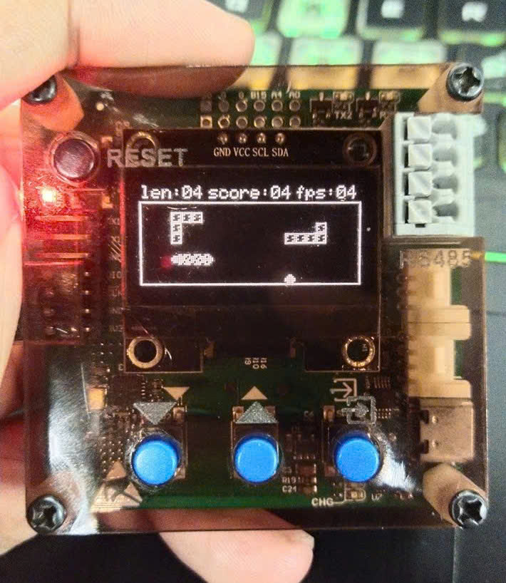
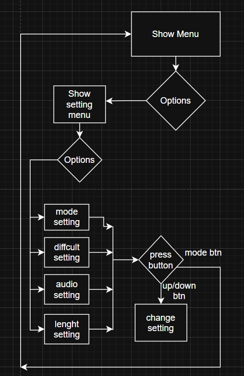
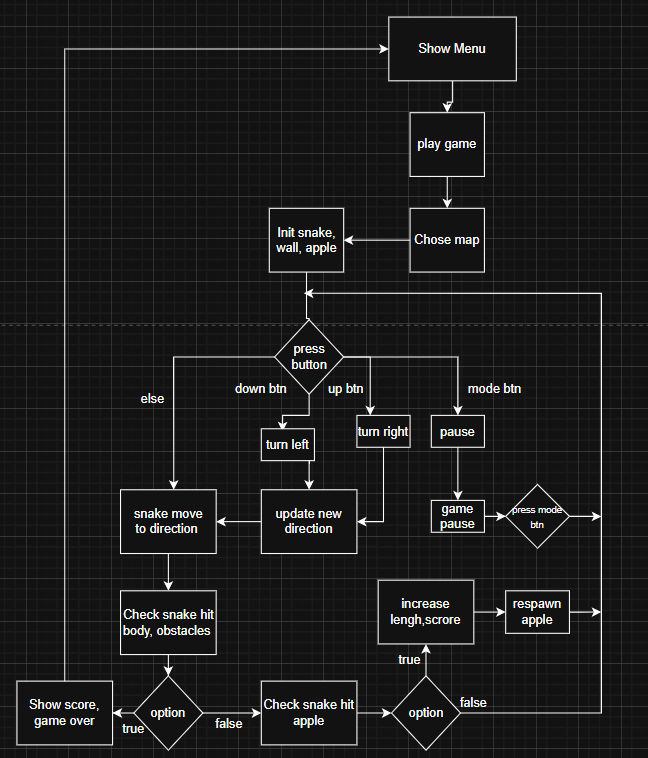
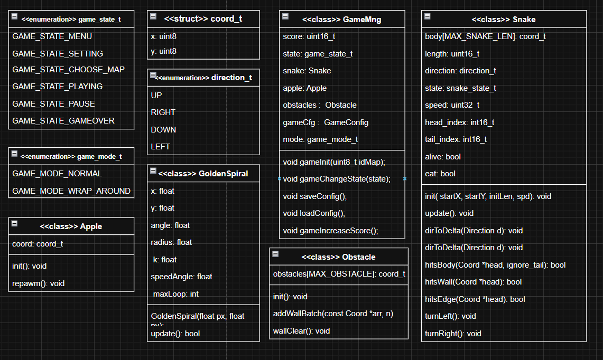

## Snake Gam built on AK-base-kit

  
  

    https://github.com/user-attachments/assets/1fa299ac-dec4-4440-a680-629d9f9415f1
  

This game was built on top of AK-OS (a lightweight RTOS) together with a small OLED system. The main purpose was to experiment with an event-driven task model — using tasks, message/events, and non-blocking flows — while still keeping the whole project simple and small enough to run on a low-power MCU.

## I.Introduction
This is a minimalist Snake Game project running on STM32L151 with a 128×64 OLED display, 1 piezo buzzer and 3 physical push buttons for input control.

The game is designed to be fully standalone on the MCU (no PC connection needed). It supports multiple maps, multiple difficulty levels, persistent user config, stored highscores and in-game animations.

- This repository demonstrates:
- low-cost embedded game logic on an ultra-low-power MCU
- simple scene/state management (Menu → Map Select → Gameplay → Game Over)
- saving persistent user configuration + highscores via internal Flash
- hardware UI feedback via buzzer events
- auto screen saver: enters idle animation after 5 seconds of no input (prevents OLED burn-in and looks cool)

## II.Features

- Game rendered on LCD Oled 1.3"(128x64)
- Controlled by 3 physical buttons (Left, Right, Mode)
- Simple sound effects using a passive buzzer (click, score, game over, ...)
- Game config + high score are stored in STM32L15 EEPROOM
- Data integrity guaranteed with uint16 checksum
- Smooth animations for all movements
- Snake, food and walls are drawn with bitmap icons (more lively than plain pixels)
- User-adjustable mode, difficulty and buzzer on/off
- Built-in screen saver: if no user action for 5 seconds, system switches into idle screen

## III.Flow Charts
The project logic is organized into two main flows: **Settings** and **Gameplay**.  
Below diagrams illustrate the transitions between screens, tasks, and user interactions:

  
  

## IV.Class

## V.Task
Each task runs independently and has its own private stack. Tasks that handle messages require a message queue
- Event Handling: Tasks respond to events by executing actions in response to messages.
- Synchronization: Tasks ensure events are processed in order, avoiding conflicts between concurrent actions.
- Control Flow Management: Task priorities determine execution order for multiple events.
- Logic Separation: Tasks allow modular design, keeping event handling logic clear and readable.
- Task Hierarchy: Task levels define message-processing priority in the system queue.

| Task ID             | Priority Level       | Task Function       |
|--------------------|-------------------|------------------|
| AC_TASK_SYSTEM_ID   | TASK_PRI_LEVEL_2   | task_system       |
| AC_TASK_DBG_ID      | TASK_PRI_LEVEL_4   | task_dbg          |
| AC_TASK_DISPLAY_ID  | TASK_PRI_LEVEL_4   | task_display      |
| AC_TASK_LIFE_ID     | TASK_PRI_LEVEL_6   | task_life         |
| AC_TASK_IDLE_ID     | TASK_PRI_LEVEL_6   | task_idle         |

## Task Life

## Task Idle

## Task Display
Task screen manage all screens in this application including:
- Start up screen
- Menu screen
- Map screen
- Game play screen
- Setting screen
- Idle screen

## VI.EEPROM Storage
Game settings and high scores are persistently stored in the STM32L151 flash(0X0800 0000)
## Stored data:

## Data integrity:

