## Snake Gam built on AK-base-kit

  

https://github.com/user-attachments/assets/8ab2e111-32e4-478b-8cb4-f2843a4841f3

- The gameplay is inspired by the classic Snake game on old Nokia phones. The logic stays very simple — a moving player, basic direction control, and item pickups — making it a good fit for testing how an event-driven system handles periodic updates and input without blocking.
  
- This game was built on top of AK-OS. The main purpose was to experiment with an event-driven pattern — using tasks, message, events, and non-blocking flows — while still keeping the whole project simple and small enough to run on a MCU (STM32l151).

## I.Introduction
This is a minimalist Snake Game project running on STM32L151 with a 128×64 OLED display, 1 piezo buzzer and 3 physical push buttons for input control.

The game is designed to be fully standalone on the MCU (no PC connection needed). It supports multiple maps, multiple difficulty levels, persistent user config, stored highscores and in-game animations.

- This repository demonstrates:
- low-cost embedded game logic on an ultra-low-power MCU
- simple scene/state management (Menu → Map Select → Gameplay → Game Over)
- saving persistent user configuration + highscores via internal Flash
- hardware UI feedback via buzzer events
- auto screen saver: enters idle animation after 5 seconds of no input (prevents OLED burn-in and looks cool)

## II.Features

- Game rendered on LCD Oled 1.3"(128x64)
- Controlled by 3 physical buttons (Left, Right, Mode)
- Simple sound effects using a passive buzzer (click, score, game over, ...)
- Game config + high score are stored in STM32L15 EEPROOM
- Data integrity guaranteed with uint16 checksum
- Smooth animations for all movements
- Snake, food and walls are drawn with bitmap icons (more lively than plain pixels)
- User-adjustable mode, difficulty and buzzer on/off
- Built-in screen saver: if no user action for 5 seconds, system switches into idle screen

## III. Architecture
### 1.Memory Map

| Region             | Address Range              | Description                          |
|--------------------|----------------------------|--------------------------------------|
| Bootloader         | 0x08000000 – 0x08001FFF    | 8 KB region, protected, runs on boot |
| BSF                | 0x08002000 – 0x08002FFF    | 4 KB, stores boot flags & headers    |
| Application start  | 0x08003000                 | Main firmware                        |
| Ext_Flash start    | 0x80000                    | Storage new firmware                 |

### 2. System Overview
### 2.1. Event-Driven Architecture
- A system model where all behaviors are triggered by events.
- Each event is packaged into a message, placed in a task’s queue, and processed by a non-blocking handler.

### 2.2 Message (ak_msg)
- The basic communication unit between tasks. Three types:
- Pure message – contains only a signal
- Common message – signal + fixed-size payload
- Dynamic message – signal + dynamically allocated payload
- Each message includes: signal, source/destination IDs, ref_count, and a linked-list pointer.
  
### 2.3. Signal
- An identifier for an event. Examples: TIMER_TICK, AC_DISPLAY_SHOW_IDLE, FW_UPDATE_REQ.
- A signal determines what action a task will perform.
  
### 2.4. Task
- An active object responsible for a specific group of operations.
Each task has:
- a priority
- a message queue
- a handler function
- optional polling function
- optional state machine
- Tasks do not run continuously — they execute only when a message arrives.

### 2.5. Task Scheduler
- A priority-based dispatcher.
- It selects the highest-priority task that has pending messages, executes its handler, and then returns to the scheduler loop.
- No preemption, no context switching — purely event-driven.

### 2.6. Priority Queue
- Each priority level has its own message queue.
- A global bitmask (task_ready) tracks which queues contain messages.
- The scheduler uses a lookup (LOG2LKUP()) to find the highest active priority efficiently.

### 3. System Flow
### 3.1 Task Scheduler Flow

    

  

### 3.2 Task post Flow

  

## IV. Game Flow Charts
### The project logic is organized into two main flows: **Settings** and **Gameplay**.  
### Game Play Flow

  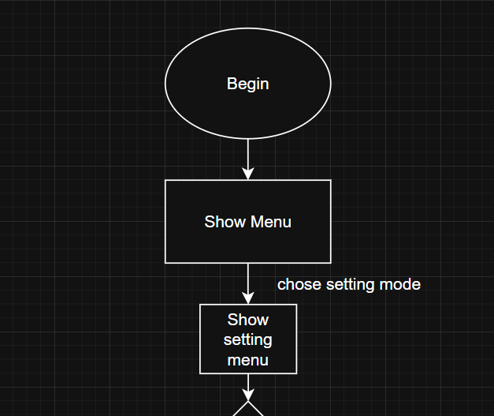  

  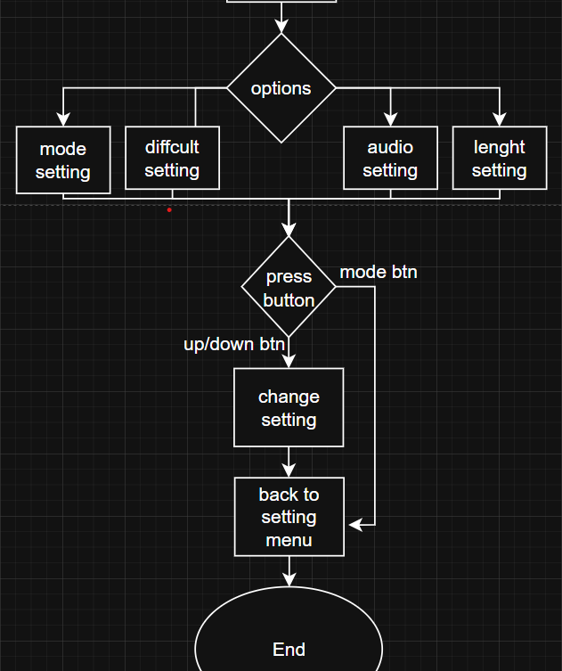

### Game Menu Flow

  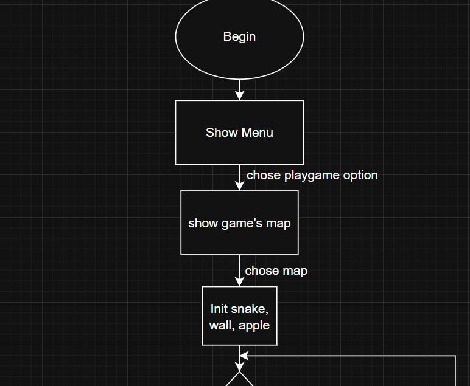

  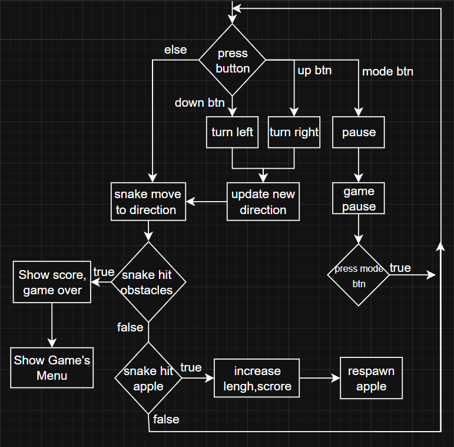

## V.Class
### The game is structured around a small set of main classes, each responsible for a core part of the gameplay:
- Class Game — manages the overall game lifecycle, state updates, and coordination between components.

  

- Class Snake — represents the snake entity: position, length, movement direction, and update logic.

  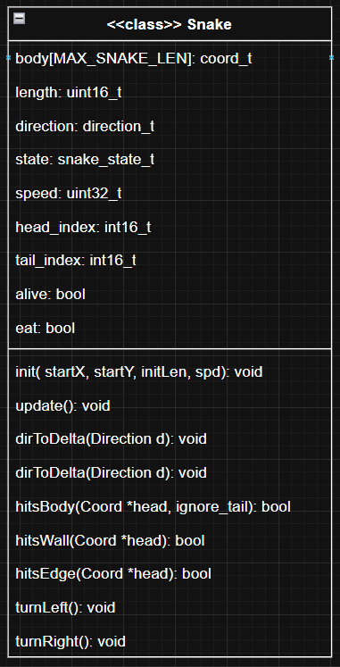

- Class Obstacle — defines static obstacles on the map.

  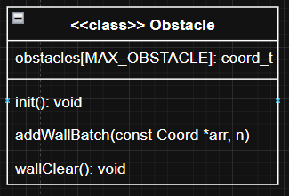

- Class Apple — handles the apple’s position and the events triggered when the snake eats it.

  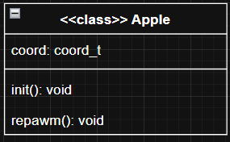

### In addition to the main classes, the game also uses several lightweight structs to hold simple data elements

  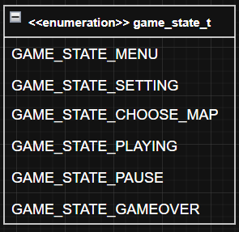

  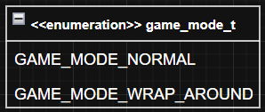

## VI.Task
Each task runs independently and has its own private stack. Tasks that handle messages require a message queue
- Event Handling: Tasks respond to events by executing actions in response to messages.
- Synchronization: Tasks ensure events are processed in order, avoiding conflicts between concurrent actions.
- Control Flow Management: Task priorities determine execution order for multiple events.
- Logic Separation: Tasks allow modular design, keeping event handling logic clear and readable.
- Task Hierarchy: Task levels define message-processing priority in the system queue.

| Task ID             | Priority Level       | Task Function       |
|--------------------|-------------------|------------------|
| AC_TASK_SYSTEM_ID   | TASK_PRI_LEVEL_2   | task_system       |
| AC_TASK_DBG_ID      | TASK_PRI_LEVEL_4   | task_dbg          |
| AC_TASK_DISPLAY_ID  | TASK_PRI_LEVEL_4   | task_display      |
| AC_TASK_LIFE_ID     | TASK_PRI_LEVEL_6   | task_life         |
| AC_TASK_IDLE_ID     | TASK_PRI_LEVEL_6   | task_idle         |

## VII.EEPROM Storage
Game settings and high scores are persistently stored in the STM32L151 flash(0X0800 0000)
## Stored data:

## VIII. OTA Firmware Update using UART Shell + External Flash
This document describes the updated STM32 firmware update (FWU) architecture, where the update is now performed in the Application layer. Using the sys_irq_shell interface to receive data, the task_fw module to write firmware chunks into external flash.

# 2. Firmware Update Flow (MCU)
### 2.1. Receive CMD and Diasble Shell Stage

### 2.2. Meta Stage
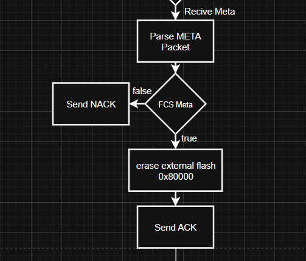

### 2.3. Transfer Firmware Stage
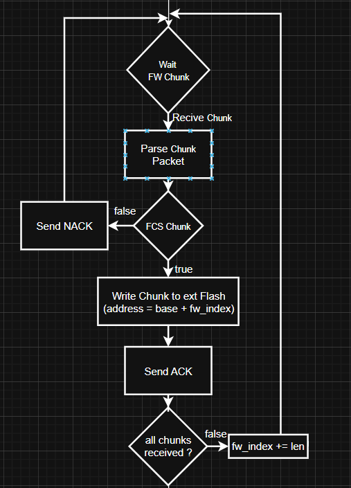

### 2.4. Final Checksum Stage

# 3. Bootloader Flow (MCU)

### 3.1. Boot Entry & Boot Flag Check

### 3.2. External → Internal Flash Update Flow

### 3.3. After Flashing (Checksum & Reset)

# 4. Host-side Flow (PC)
### 4.1. Initialization (UART Open) and Send FWSET Command

### 4.2. Send Metadata (Header)
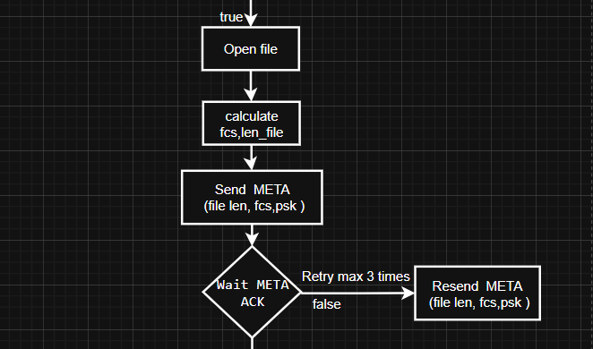

### 4.3. Transfer Firmware (Chunk Loop)

# 5. Protocol Specification
| Field | Size (bytes) | Value / Range | Description |
|-------|--------------:|---------------|-------------|
| SOP   | 1             | 0xEF          | Start of packet |
| LEN   | 1             | 0..254        | Number of DATA bytes |
| DATA  | LEN           | —             | Payload (CMD + payload) |
| FCS   | 1             | XOR           | LEN ^ data[0] ^ data[1] ... (simple XOR) |
